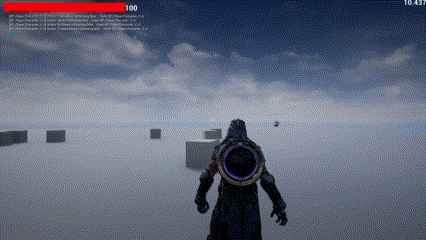
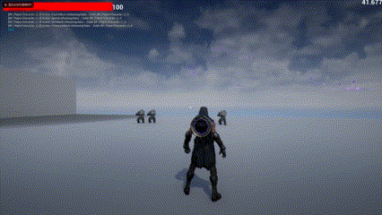
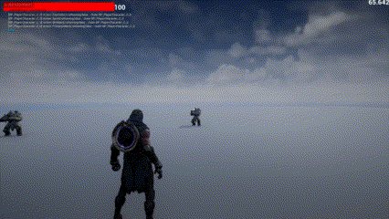
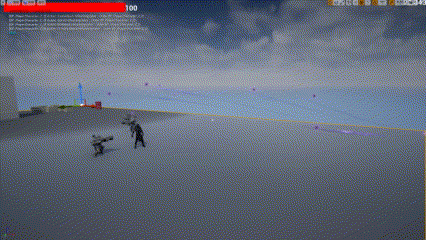
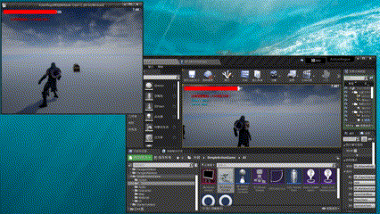

# SimpleActionGame

## Demo介绍

通过使用C++实现简易AI的自动寻路，自动攻击等操作；实现人物传送、黑洞吸取、类艾卡西亚暴雨等攻击方式；实现使用GameplayTask控制角色状态及操作；实现客户端及服务器之间的简易交互。

以下为部分实现的功能：

1. 通过添加负向恒定的力从而实现黑洞效果。
   
   

2. 通过使用弹药完成人物的传送。
   
   

3. 对击中的对象施加一个有持续时间的debuff
   
   

4. 使用贝塞尔曲线实现艾卡西亚暴雨以及实现追踪弹药
   
   

5. 使用RPC实现服务器和客户端之间的同步交互。
   
   